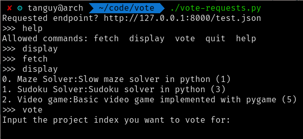

# “Ce qui compte ce n'est pas le vote, c'est comment on compte les votes.”
- Joseph Staline

## Introduction

Pour choisir le projet que vous allez réaliser prochainement, on vous demande
d'implémenter un Voteur (Voter pour les anglophones). Ce voteur vous permettra
de récupérer la liste des différents projets possibles et même leur nombre de
votes actuels !

Il doit aussi être capable de vous permettre de voter à votre tour pour le
projet que vous préférez.

Le but est de vous faire découvrir le module `requests` de Python, qui simplifie
vraiment les interactions avec le protocole HTTP.

Avant de commencer à coder, il vous faudra donc installer ce module en tapant
`pip3 install requests` dans une invite de commandes.

## Implémentation en Python

Pour implémenter ceci en Python, on vous donne quelques conseils pour
architecturer votre code et rendre cela un minimum intéressant pour vous.

### La classe Voteur

Un "Voteur" est un object qui permet de voter quand la plèbe doit élir le
meilleur projet de programmation.

Votre Voteur doit contenir 4 méthodes :
* `__init__(self, endpoint: str)` : c'est le constructeur, il doit maintenir
l'endpoint comme attribut de votre classe, et initialiser un dictionnaire
vide dans lequel sera plus tard stocké la liste des projets et leurs
informations ;
* `fetch(self)` : cette méthode effectue une requete de type `GET` vers le
serveur pour récupérer les informations, elle doit assigner ces informations au
format json au dictionnaire contenu dans votre classe. Intéressez-vous à la
méthode `requests.get()` ;
* `display(self)` : cette méthode affiche les informations récupérées
après avoir utilise `fetch()`. Libre à vous de choisir sous quelle forme vous
souhaitez afficher votre dictionnaire.
* `vote(self, index: int)` : cette méthode effectue une requete de type `POST`
vers le serveur afin de demander la modification des informations, on parle
bien ici de faire entendre votre voix dans ce vote ! Pour cela, il vous faudra
envoyer un json contenant un unique champ "vote" dont la valeur doit être
l'index du projet pour lequel vous votez. Vous aurez donc besoin d'afficher le
dictionnaire auparavant pour prendre connaissances de ces index. Pensez à jeter
un oeil à la documentation de la méthode `requests.post()`.

Votre Voteur contient donc deux attributs :
* `self.endpoint` est une chaîne de caractères qui contient l'URL pointant sur
l'information que vous souhaitez récupérer. Dans notre cas, il s'agit de
`vote.prologin.space" mais on vous déconseille d'hardcoder cette valeur ;
* `self.data` est le dictionnaire qui contient la liste des projets et leurs
* informations.

### La méthode `main`

La méthode `main` doit mettre en place une pseudo invite de commandes vous
permettant d'utiliser votre classe pour communiquer avec le serveur.

Vous devez demander à l'utilisateur de rentrer une commande, et en fonction de
la commande entrée, votre Voteur doit appeler la méthode correspondante.
L'utilisateur doit pouvoir être capable de rentrer plusieurs commandes d'affilée
sans avoir à relancer le programme à chaque fois !

## Conclusion

Faites place à votre imagination, si vous avez des idées pour améliorer votre
code, le rendre encore plus simple d'utilisation n'hésitez pas ! Egalement, les
organisateurs sont la pour répondre à toutes vos questions ou au moins essayer
de chercher des réponses avec vous donc n'ayez pas peur de demander !

Pour finir, voila un exemple de ce que notre code fait :)
A vous de voir si vous souhaitez vous rapprocher de ce style ou faire quelque
chose de totalement original !

